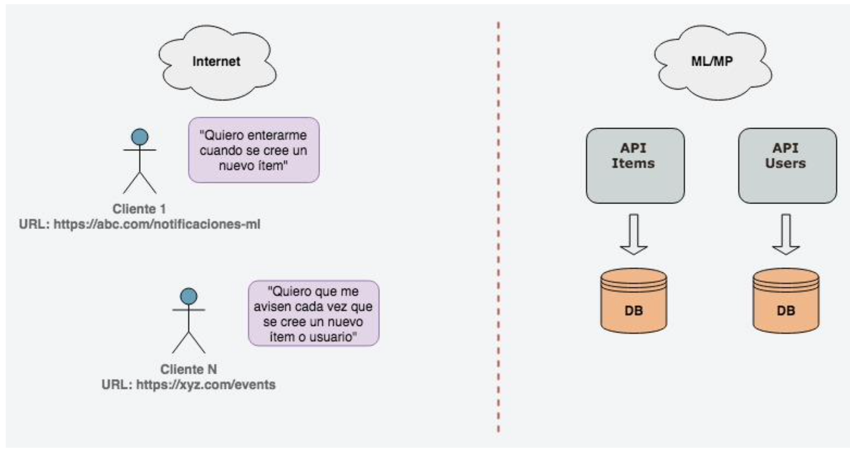

# Notificaciones Externas
Ejercicio de Arquitectura / Octubre 2024

## Enunciado
MercadoLibre tiene dos APIs, la API de ítems y la API de usuarios. Son independientes; cada una tiene su propia gestión de datos. Nuestros clientes (developers externos, acá "integradores") quieren enterarse cada vez que se crea un item, un usuario, o ambas cosas. El developer debe declarar una URL, que le pertenece, en donde quiere recibir los eventos -vía un HTTP POST de nuestra parte- y el tipo de evento que le interesa. Diseñar un mecanismo que envíe mensajes en formato JSON a nuestros clientes, sin pérdida de eventos.

### Especificaciones
- Las APIs de Ítems y Users tienen los siguientes throughputs:
    - API Users: 20.000 RPM
    - API Items: 150.000 RPM
- Se espera que en este mecanismo se tenga alrededor de más de 10.000 integradores.
- Este sistema debe estar totalmente aislado para no afectar el funcionamiento normal de las APIs dentro de Mercado Libre.
- Se debe tener presente que todos los integradores no tienen las mismas capacidades para atender el flujo de eventos ocurridos dentro de Mercado Libre.
### Requisitos
- Arquitectura del sistema de la solución planteada.
    - Sistemas
    - Seguridad
    - Tecnologías
- Diseño básico APIs con su debida documentación de los servicios planteados.
- Documentación para los integradores
- Plan de monitoreo y alertas planteadas para el sistema
- Plan y documentación de escalabilidad del sistema
- Documentación en repositorio o herramienta en la nube **(adicional)**
- Código en repositorio de las aplicaciones planteadas para el sistema **(adicional)**
- Solución planteada desplegado en cloud **(adicional)**
---
## Información del proyecto
[![Gitflow][skill-gitflow-shield]][skill-gitflow-url]
[![ConventionalCommits][skill-conventionalcommits-shield]][skill-conventionalcommits-url]

> [!TIP]
> En este archivo README encontrará texto entre comillas ("text") generalemnte hace referencia a términos que el autor decidió no traducir con el fin de conservar su significado dentro de la industria de TI.

### Estructura del proyecto

En esta sección se describe la estructura del proyecto, así como el contenido de las carpetas principales.

    ├── docs                            <- Archivos usandos en README.md
    ├── legacy_apis                     <- Impostores que simulan las APIs de Users, Items
    │   ├── ops                         <- Imágenes docker que permiten lanzar los impostores     
    │   │   ├── database_scripts        <- DetectID custom SQL scripts for populate database
    │   │   └── playbooks               <- Ansible playbooks for automate DetectID Database installation 
    │   └── server                      <- DetectID server resources for build DID server docker image
    │       └── playbooks               <- Ansible playbooks for automate DetectID server installation
    └── VaultBank                       <- VaultBank resources

## Contribuir al proyecto Notificaciones Externas

Se quiere que contribuir a este proyecto sea lo más fácil y transparente posible.

### Pull Requests
La estrategia de "branching" que se usa en el proytecto es gitflow. Gitflow es un "branching model" alternativo en Git que implica el uso de ramas de características y múltiples ramas principales. Más información en [Gitflow Workflow](https://www.atlassian.com/git/tutorials/comparing-workflows/gitflow-workflow#:~:text=Gitflow%20is%20a%20legacy%20Git,software%20development%20and%20DevOps%20practices.)

### Conventional commits

Este repositorio utiliza la especificación "Conventional commits" [Conventional Commits](https://www.conventionalcommits.org/en/v1.0.0/#summary).

El "commit" debe tener un título que siga la siguiente especificación.

- `fix: ` prefijo en el título que indica que el PR es un "bug fix" y se debe generar un "PATCH".
- `feat: ` prefijo en el título que indica que el PR es una característica o "feature" y un "MINOR release" debe ser generado.
- `docs: ` prefijo en el título que indica que el PR está relacionado únicamente con documentación y no es necessario generar un nuevo "release".
- `chore: ` prefijo en el título que indica que el PR está relacionado únicamente a limpiar el proyecto y no es necesario generar un nuevo "release".
- `test: ` prefijo en el título que indica que el PR está relacionado únicamente con pruebas y no es necesario generar un nuevo "release".
- `refactor: ` prefijo en el título que indica que el PR está relacionado únicamente con "refactoring"y no es necesario generar un nuevo release.

Qué pasa con los "MAJOR release"? se debe agregar `!` al prefijo, algo como `fix!: ` o `refactor!: `

---
## APIs Legacy
[![Mountebank][skill-mountebank-shield]][skill-mountebank-url]
[![Colima][skill-colima-shield]][skill-colima-url]
[![docker][skill-docker-shield]][skill-conventionalcommits-url]

Con el fin de simular el comportamiento de las APIs Users y Items (descritas en el enunciado), se utiliza la herramienta [Mountebank][skill-mountebank-url] la cual,  a través de impostores, permite simular las características de "Legacy" y aislamiento que se solicitan en el ejercicio.
Se crea un archivo tipo bash, que lanza el contenedor con Mountebank desplegado localmente en el puerto 2525.
- Se asume que los APIs de Users y Items responden con un statusCode 201 cuando se hace un POST y se crea la entidad exitosamente.
- Se asume que los APIs de Users y Items en la invocación de los otros métodos (GET, PUT, DELETE) se responden un statusCode 200 con el detalle del resultado de la operación.
- Se crean dos impostores que corresponden a los dos APIS de Users y Items con la estructura descrita a continuación. 
```json
{
  "port": 4545,
  "protocol": "http",
  "defaultResponse": {
    "statusCode": 400,
    "body": "Bad Request",
    "headers": {}
  },
  "stubs": [
    {
      "responses": [
        {
          "is": {
            "statusCode": 201,
            "headers": {
              "Content-Type": "application/json"
            },
            "body": {
              "userId": "0a38296474c2",
              "name": "John Doe"
            }
          }
        }
      ],
      "predicates": [
        {
          "deepEquals": {
            "method": "POST",
            "path": "/user"
          }
        }
      ]
    },
    {
      "responses": [
        {
          "is": {
            "statusCode": 200,
            "headers": {
              "Content-Type": "application/json"
            },
            "body": {
              "userId": "0a38296474c2",
              "name": "John Doe"
            }
          }
        }
      ],
      "predicates": [
        {
          "or": [
            {
              "deepEquals": {
                "method": "GET",
                "path": "/user"
              }
            },
            {
              "deepEquals": {
                "method": "PUT",
                "path": "/user"
              }
            },
            {
              "deepEquals": {
                "method": "DELETE",
                "path": "/user"
              }
            }
          ]
        }
      ]
    }
  ]
}
```
Para obtener la respuesta de los impostores se deben ejecutar los siguietnes comandos:
### Users
```bash
curl -i -X GET  http://localhost:4545/user
HTTP/1.1 200 OK
Content-Type: application/json
Connection: close
Date: Sun, 20 Oct 2024 17:04:24 GMT
Transfer-Encoding: chunked

{
    "userId": "0a38296474c2",
    "name": "John Doe"
}
```
```bash
curl -i -X POST  http://localhost:4545/user
HTTP/1.1 201 Created
Content-Type: application/json
Connection: close
Date: Sun, 20 Oct 2024 17:04:30 GMT
Transfer-Encoding: chunked

{
    "userId": "0a38296474c2",
    "name": "John Doe"
}
```
```bash
curl -i -X PUT  http://localhost:4545/user
HTTP/1.1 200 OK
Content-Type: application/json
Connection: close
Date: Sun, 20 Oct 2024 17:04:42 GMT
Transfer-Encoding: chunked

{
    "userId": "0a38296474c2",
    "name": "John Doe"
}
```
```bash
curl -i -X DELETE  http://localhost:4545/user
HTTP/1.1 200 OK
Content-Type: application/json
Connection: close
Date: Sun, 20 Oct 2024 17:04:53 GMT
Transfer-Encoding: chunked

{
    "userId": "0a38296474c2",
    "name": "John Doe"
}
```
```bash
curl -i -X TRACE  http://localhost:4545/user
HTTP/1.1 400 Bad Request
Connection: close
Date: Sun, 20 Oct 2024 17:05:53 GMT
Transfer-Encoding: chunked

Bad Request
```
### Items
```bash
curl -i -X GET  http://localhost:5555/item
HTTP/1.1 200 OK
Content-Type: application/json
Connection: close
Date: Sun, 20 Oct 2024 17:33:46 GMT
Transfer-Encoding: chunked

{
    "itemId": "0a38296474c2",
    "name": "itemName"
```
```bash
curl -i -X POST  http://localhost:5555/item
HTTP/1.1 201 Created
Content-Type: application/json
Connection: close
Date: Sun, 20 Oct 2024 17:34:14 GMT
Transfer-Encoding: chunked

{
    "itemId": "0a38296474c2",
    "name": "itemName"
}
```
```bash
curl -i -X PUT  http://localhost:5555/item
HTTP/1.1 200 OK
Content-Type: application/json
Connection: close
Date: Sun, 20 Oct 2024 17:34:35 GMT
Transfer-Encoding: chunked

{
    "itemId": "0a38296474c2",
    "name": "itemName"
}
```
```bash
curl -i -X DELETE  http://localhost:5555/item
HTTP/1.1 200 OK
Content-Type: application/json
Connection: close
Date: Sun, 20 Oct 2024 17:35:01 GMT
Transfer-Encoding: chunked

{
    "itemId": "0a38296474c2",
    "name": "itemName"
}
```
```bash
curl -i -X TRACE  http://localhost:5555/item
HTTP/1.1 400 Bad Request
Connection: close
Date: Sun, 20 Oct 2024 17:35:21 GMT
Transfer-Encoding: chunked

Bad Request
```
<!-- MARKDOWN LINKS & IMAGES -->
<!-- https://shields.io/ -->

[skill-mountebank-shield]: https://img.shields.io/badge/Mountebank-2.9.1-blue
[skill-mountebank-url]: https://www.mbtest.org/docs/gettingStarted

[skill-gitflow-shield]: https://img.shields.io/badge/Git_Flow-red
[skill-gitflow-url]: https://www.atlassian.com/git/tutorials/comparing-workflows/gitflow-workflow#:~:text=Gitflow%20is%20a%20legacy%20Git,software%20development%20and%20DevOps%20practices.

[skill-conventionalcommits-shield]: https://img.shields.io/badge/Conventional_Commits-1.0.0-pink
[skill-conventionalcommits-url]: https://www.conventionalcommits.org/es/v1.0.0/

[skill-colima-shield]: https://img.shields.io/badge/Colima-0.7.5-orange
[skill-colima-url]: https://github.com/abiosoft/colima

[skill-docker-shield]: https://img.shields.io/badge/Docker_CE-24.0.6-yellow
[skill-docker-url]: https://docs.docker.com/engine/install/
