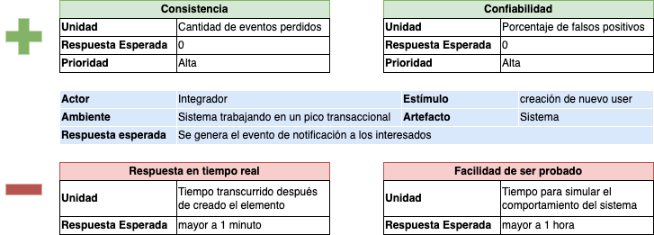
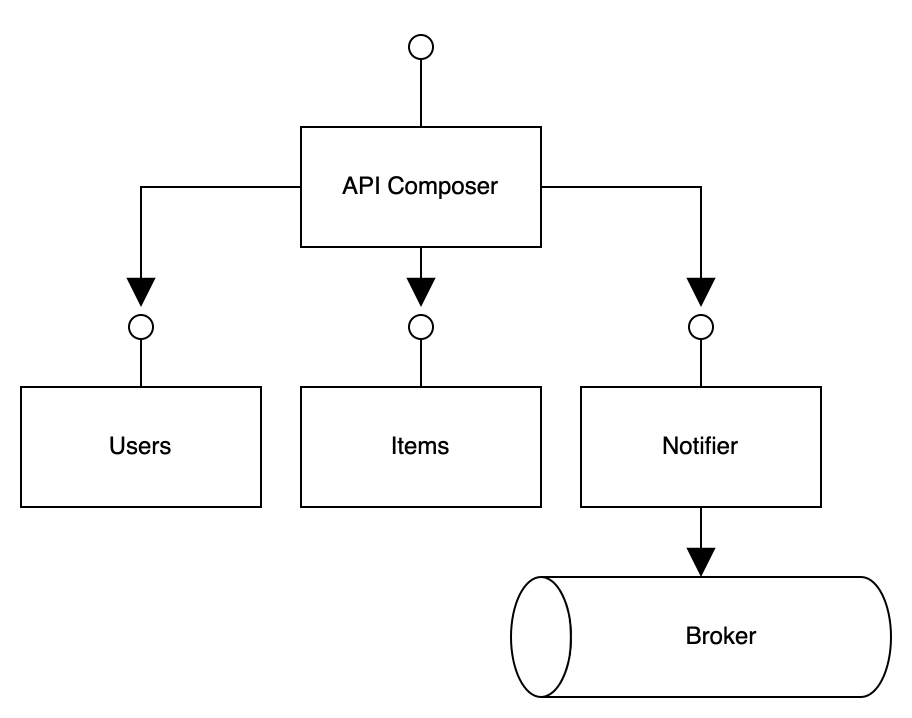
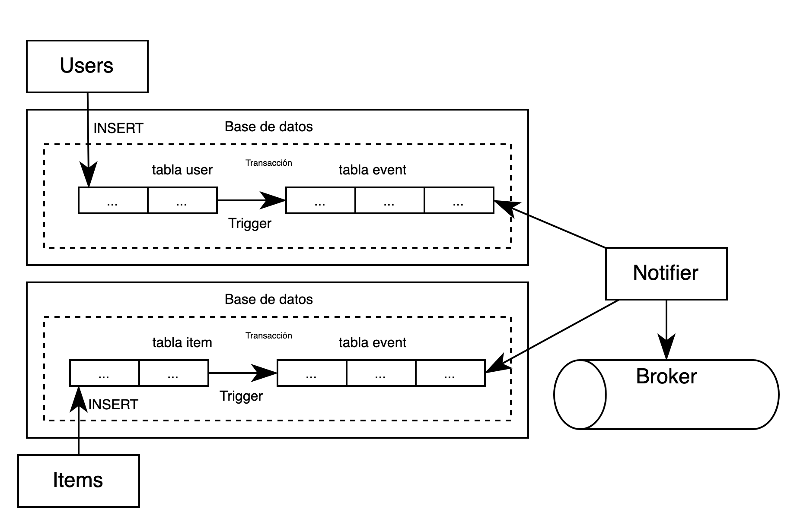
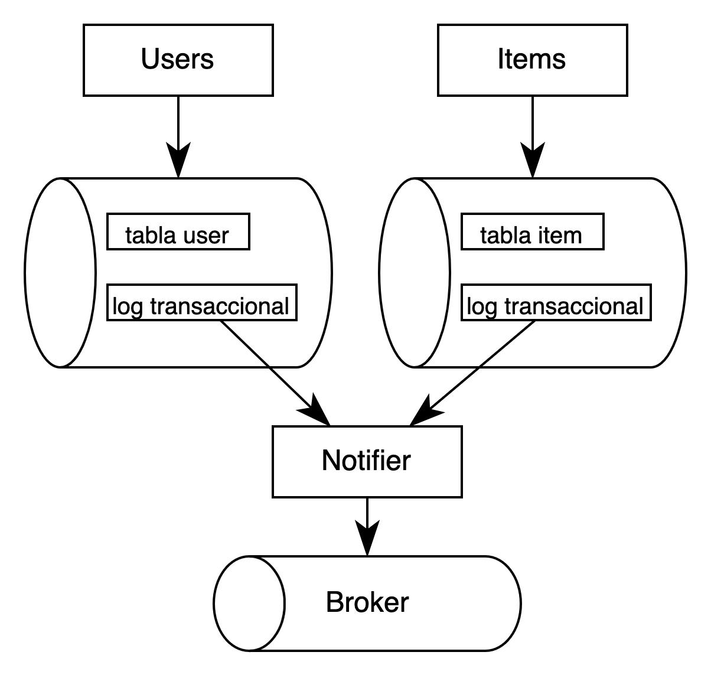

# Notificaciones Externas
Ejercicio de Arquitectura / Octubre 2024

## Enunciado
MercadoLibre tiene dos APIs, la API de ítems y la API de usuarios. Son independientes; cada una tiene su propia gestión de datos. Nuestros clientes (developers externos, acá "integradores") quieren enterarse cada vez que se crea un item, un usuario, o ambas cosas. El developer debe declarar una URL, que le pertenece, en donde quiere recibir los eventos -vía un HTTP POST de nuestra parte- y el tipo de evento que le interesa. Diseñar un mecanismo que envíe mensajes en formato JSON a nuestros clientes, sin pérdida de eventos.

### Especificaciones
- Las APIs de Ítems y Users tienen los siguientes throughputs:
    - API Users: 20.000 RPM
    - API Items: 150.000 RPM
- Se espera que en este mecanismo se tenga alrededor de más de 10.000 integradores.
- Este sistema debe estar totalmente aislado para no afectar el funcionamiento normal de las APIs dentro de Mercado Libre.
- Se debe tener presente que todos los integradores no tienen las mismas capacidades para atender el flujo de eventos ocurridos dentro de Mercado Libre.
### Requisitos
- Arquitectura del sistema de la solución planteada.
    - Sistemas
    - Seguridad
    - Tecnologías
- Diseño básico APIs con su debida documentación de los servicios planteados.
- Documentación para los integradores
- Plan de monitoreo y alertas planteadas para el sistema
- Plan y documentación de escalabilidad del sistema
- Documentación en repositorio o herramienta en la nube **(adicional)**
- Código en repositorio de las aplicaciones planteadas para el sistema **(adicional)**
- Solución planteada desplegado en cloud **(adicional)**
---
## Información del proyecto
[![Gitflow][skill-gitflow-shield]][skill-gitflow-url]
[![ConventionalCommits][skill-conventionalcommits-shield]][skill-conventionalcommits-url]

> [!TIP]
> En este archivo README encontrará texto entre comillas ("text") generalemnte hace referencia a términos que el autor decidió no traducir con el fin de conservar su significado dentro de la industria de TI.

### Estructura del proyecto

En esta sección se describe la estructura del proyecto, así como el contenido de las carpetas principales.

    ├── docs                            <- Archivos usandos en README.md
    └── legacy_apis                     <- Impostores que simulan las APIs de Users, Items
       └── ops                          <- Imágenes docker que permiten lanzar los impostores     
          └── mountebank_launcher.sh    <- Script bash que despliega impostores
    

## Contribuir al proyecto Notificaciones Externas

Se quiere que contribuir a este proyecto sea lo más fácil y transparente posible.

### Pull Requests
La estrategia de "branching" que se usa en el proytecto es gitflow. Gitflow es un "branching model" alternativo en Git que implica el uso de ramas de características y múltiples ramas principales. Más información en [Gitflow Workflow](https://www.atlassian.com/git/tutorials/comparing-workflows/gitflow-workflow#:~:text=Gitflow%20is%20a%20legacy%20Git,software%20development%20and%20DevOps%20practices.)

### Conventional commits

Este repositorio utiliza la especificación "Conventional commits" [Conventional Commits](https://www.conventionalcommits.org/en/v1.0.0/#summary).

El "commit" debe tener un título que siga la siguiente especificación.

- `fix: ` prefijo en el título que indica que el PR es un "bug fix" y se debe generar un "PATCH".
- `feat: ` prefijo en el título que indica que el PR es una característica o "feature" y un "MINOR release" debe ser generado.
- `docs: ` prefijo en el título que indica que el PR está relacionado únicamente con documentación y no es necessario generar un nuevo "release".
- `chore: ` prefijo en el título que indica que el PR está relacionado únicamente a limpiar el proyecto y no es necesario generar un nuevo "release".
- `test: ` prefijo en el título que indica que el PR está relacionado únicamente con pruebas y no es necesario generar un nuevo "release".
- `refactor: ` prefijo en el título que indica que el PR está relacionado únicamente con "refactoring"y no es necesario generar un nuevo release.

Qué pasa con los "MAJOR release"? se debe agregar `!` al prefijo, algo como `fix!: ` o `refactor!: `

---
## APIs Legacy
[![Mountebank][skill-mountebank-shield]][skill-mountebank-url]
[![Colima][skill-colima-shield]][skill-colima-url]
[![docker][skill-docker-shield]][skill-conventionalcommits-url]

**El detalle del despliegue de las APIs legacy se encuentra en: [legacy_apis/Imposters.md](legacy-apis/Imposters.md)**

## Proceso de análisis y diseño
## Restricciones y asunciones  
- Se asume que las bases de datos donde se peristen los registros de las APIs User & Item son tipo relacional.
- Se asume que para los Integradores no hace la diferencia tener la notificación de creación de elementos en tiempo real, es decir que es aceptable tener la respuesta minutos después.

### Attribute Driven Design
[![Attribute Driven Design][skill-add-shield]][skill-add-url]

En esta etapa inicial, para tomar las decisiones de diseño se utiliza Attribute Driven Design (ADD). Que se puede resumir en los siguientes puntos:

- Se toman como entrada para el diseño, los escenarios de calidad.
- Se basa en un proceso de descomposición recursivo de los elementos arquitecturales.
- Se deben satisfacer los requerimientos de calidad priorizados.
- Introducen situaciones de contienda (trade-offs).
- Como salida se obtiene una descomposición modular del sistema.
- El proceso termina cuando no se consideran más atributos de calidad.

### ASR
Un ASR es un Requerimiento no funcional Arquitecturalmente Significativo. De la lista de atributos de calidad que se pueden definir en el sistema, se escogen los que tienen mayor impacto en las motivaciones del sistema. Para esta prueba se decide favorecer los atributos de calidad de Consistencia de los datos (eventos) y Confiabilidad, debido a que en el enunciado de la prueba se estipula que no debe haber pérdida de eventos. En la siguiente tabla se muestran el detalle del análisis y los trade-offs que se asumen con la decisión.

### Soluciones contempladas para generar la notificación
| **Id** | **Patrón de diseño**    | **Descripción**                                                                                                                                                                                                                                                                                                                                                                                                                                                                        | **Diagrama**                   | Análisis                                                                                                                                                                                                                                                                                                                                                                                                                                                                                                                                    | Referencia                                                                                       | **Estado**              |
|--------|-------------------------|----------------------------------------------------------------------------------------------------------------------------------------------------------------------------------------------------------------------------------------------------------------------------------------------------------------------------------------------------------------------------------------------------------------------------------------------------------------------------------------|--------------------------------|---------------------------------------------------------------------------------------------------------------------------------------------------------------------------------------------------------------------------------------------------------------------------------------------------------------------------------------------------------------------------------------------------------------------------------------------------------------------------------------------------------------------------------------------|--------------------------------------------------------------------------------------------------|-------------------------|
| 1      | API Composition         | Se contempla la posibilidad  de poner un componente tipo "API Composer" delante de las APIs, que se encargue de redireccionar las peticiones entrantes a los servicios reales, y en cualquiera de los dos momentos (recibir petición o entregar respuesta) generar una petición a un tercer servicio que se encargue de generar la notificación de creación de elemento (Item o User) y enviarla a un broker de mensajería.                                                            |    | Es una solución que puede ayudar a la generación de la notificación sin modificar las APIs legacy, sin embargo se agrega un componente al sistema, el cual se puede convertir en un eventual punto de fallo adicional y agrega latencia a la petición inicial. Adicionalmente en caso de generarse algun error de comunicación entre el API Commposer y cualquier API Legacy se pueden perder eventos y no se notificaría a los interesados                                                                                                 | [API Composition](https://microservices.io/patterns/data/api-composition.html)                   | Descartado              |
| 2      | Transactional outbox    | Esta posibilidad consiste en agregar un trigger y una tabla de eventos en la base de datos. Cuando se cree un nuevo registro en la tabla users o en la tabla items, se dispararía la creación de registros en la tabla de eventos, la cual a su vez está siendo monitoreada por un componente que sería el encargado de generar la notificación y ponerla en un broker de mensajería                                                                                                   |  | Es una solución que cumple con la premisa de no alterar los servicios, sin embargo se está agregando una responsabilidad a la base de datos y se desconocen las limitaciones de recursos de las mismas, en un escenario donde las bases de datos tengan suficientes recursos para generar el trigger y crear registros en una nueva tabla de eventos puede ser una solución adecuada.                                                                                                                                                       | [Transactional outbox](https://microservices.io/patterns/data/transactional-outbox.html)         | Candidato               | 
| 3      | Polling Publisher       | Es un mecanismo que puede complementar la propuesta anterior, haciendo "polling" a la nueva tabla de eventos en la base de datos.                                                                                                                                                                                                                                                                                                                                                      |                                | Puede ayudar en el caso de tener que implementar la solución candidata                                                                                                                                                                                                                                                                                                                                                                                                                                                                      | [Polling publisher](https://microservices.io/patterns/data/polling-publisher.html)               | Complemento a Candidato |
| 4      | Transaction log Tailing | En esta propuesta nos encontramos con el uso de los logs transaccionales de la base de datos, a diferencia de la propuesta anterior, se hace uso de un recurso subvalorado como los logs. Se agregaría un componente externo que tendría la responsabilidad de minar el log transaccional de la base de datos y cuando detecte que se realizó una inserción en la tabla de user o item se generaría un evento que sería enviado a los interesados a través de un broker de mensajería. |        | Es una solución que cumple con los ASR que se quieren favorecer, la consistencia de datos y la confiabilidad del sistema. Hay algo que se debe revisar con mayor detalle y es el mecanismo para hacer el seguimiento del log transaccional, que depende del motor que se está utilizando. - MySQL: binlog - Postgres: WAL - AWS DynamoDB: table streams. Se debe también habilitar la limpieza automática de los archivos de logs ya que puede representar un aumento considerable en la cantidad de Gigabytes utilizados en el disco duro. | [Transactional log tailing](https://microservices.io/patterns/data/transaction-log-tailing.html) | **Seleccionado**        | 

### - En cualquiera de ls soluciones se contempla el uso de un broker de mensajería para la generación de eventos.
<!-- MARKDOWN LINKS & IMAGES -->
<!-- https://shields.io/ -->

[skill-mountebank-shield]: https://img.shields.io/badge/Mountebank-2.9.1-blue
[skill-mountebank-url]: https://www.mbtest.org/docs/gettingStarted

[skill-gitflow-shield]: https://img.shields.io/badge/Git_Flow-red
[skill-gitflow-url]: https://www.atlassian.com/git/tutorials/comparing-workflows/gitflow-workflow#:~:text=Gitflow%20is%20a%20legacy%20Git,software%20development%20and%20DevOps%20practices.

[skill-conventionalcommits-shield]: https://img.shields.io/badge/Conventional_Commits-1.0.0-pink
[skill-conventionalcommits-url]: https://www.conventionalcommits.org/es/v1.0.0/

[skill-colima-shield]: https://img.shields.io/badge/Colima-0.7.5-orange
[skill-colima-url]: https://github.com/abiosoft/colima

[skill-docker-shield]: https://img.shields.io/badge/Docker_CE-24.0.6-yellow
[skill-docker-url]: https://docs.docker.com/engine/install/

[skill-add-shield]: https://img.shields.io/badge/ADD-3.0-yellow
[skill-add-url]: https://insights.sei.cmu.edu/library/add-30-rethinking-drivers-and-decisions-in-the-design-process/
